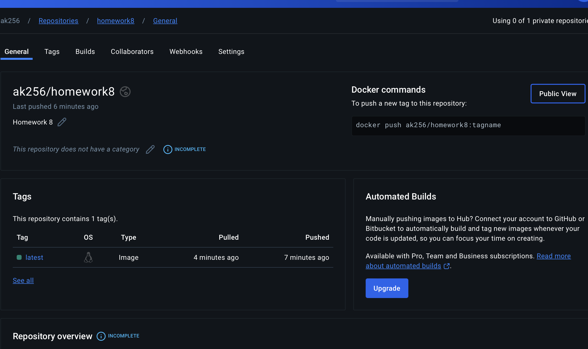

# Homework 8: Devops and Automation - Docker Part 2

# Pull the image 
docker pull ak256/homework8:latest

# Run the Docker container
docker run ak256/homework8:latest

git clone https://github.com/ak256-ak/Homework8.git
cd Homework8

pip install -r requirements.txt

python app.py

